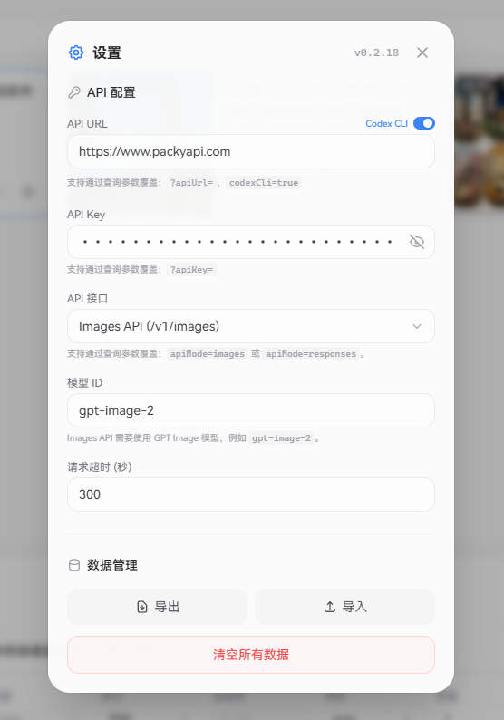

# 用转发站的gpt-image-2

## 常用转发站地址

**API地址**填写转发站提供的地址，比如以下转发站：

**请按喜好自行挑选，充值不要充多，够用就行，密钥请在对应的转发站控制台中生成**

[鹅站](https://cubence.com/)：（0.1/次）**已验证可用**

```html
API地址：https://api-dmit.cubence.com/v1/
```

[right](https://right.codes/)：（0.04/次 1k 、0.13/次 4k）**已验证可用** 

```html
API地址：https://right.codes/draw/
```

[老农](https://www.packyapi.com/)：（0.04/次） **已验证可用 可以4K 推荐！**

```html
API地址：[https://www.packyapi.com/](https://www.packyapi.com/console)   **在[gpt-image-playground](https://gpt-image-playground.cooksleep.dev/)配置中要开base64**
```

[鸡站](https://api.ikuncode.cc/)：（0.06/次） **已验证可用（不稳定）**

```html
API地址：https://api.ikuncode.cc/
```

## 方式1：使用 MintImage（跨平台原生客户端，推荐）

[MintImage](https://github.com/aiqinxuancai/MintImage) 是一款专为 gpt-image-2 设计的跨平台 AI 图像生成客户端，支持 Windows、macOS、Android、iOS，开源免费。

下载对应平台的安装包：[Releases](https://github.com/aiqinxuancai/MintImage/releases)

主要特性：

- 文生图 / 图生图，支持参考图上传
- 丰富的尺寸预设：通用比例、照片、屏幕/视频、Web、移动设备、打印纸张、图稿与插画等多个分类，也支持自定义任意宽高
- 一次最多批量生成 16 张
- 多 API 配置切换，方便在不同转发站之间切换
- 历史记录本地保存，可随时查看和编辑
- 后台运行，完成后通知提醒

首次打开后，进入设置页填写上面提供的转发站 API 地址、密钥和模型名（`gpt-image-2`），即可在主页输入提示词开始生成。

<!-- 截图占位：MintImage 主界面 -->


<!-- 截图占位：MintImage 尺寸选择器 -->


<!-- 截图占位：MintImage 生成结果与编辑 -->


<!-- 截图占位：MintImage 设置页（API 配置） -->


---

## 方式2，使用专为gpt-image-2设计的页面

访问 [https://gpt-image-playground.cooksleep.dev/](https://gpt-image-playground.cooksleep.dev/) 

进入后按照上面提供的转发站API地址填写API URL



填写完成后直接在下面输入或附加图片


也可查看生成详情并进行编辑


---

## 方式3：使用Cherry Studio

下载Cherry Studio，并安装：[https://www.cherry-ai.com/download](https://www.cherry-ai.com/download)

在设置中找到NewAPI，或者点击“添加”按钮，供应商类型选择NewAPI来新建


在模型的地方点击**加号**添加一个新模型


模型id写**gpt-image-2**，端点类型选**图像生成（OprnAI）**即可。


回到Cherry，点击加号，打开绘画


选择New API或刚才新建的提供商，以及刚才添加的模型gpt-image-2，就可以使用了

